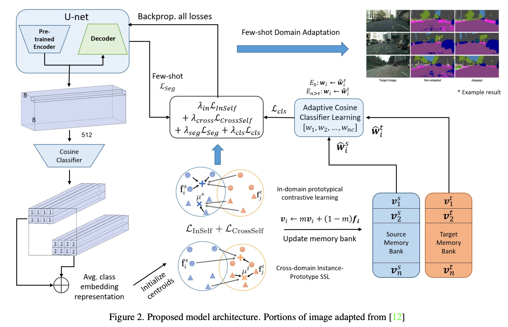

# Prototypical Cross Domain Self-Supervised Learning for Few-shot Unsupervised Domain Adaptation in Semantic Segmentation

Pytorch implementation of PCS (Prototypical Cross-domain Self-supervised network) [[link to our report](IVC_final_report.pdf)]

## Overview

Architecture of Network



Compared with state-of-the-art methods, PCS improves the mean classification accuracy over different domain pairs on FUDA by **10.5%**, **4.3%**, **9.0%**, and **13.2%** on Office, Office-Home, VisDA-2017, and DomainNet, respectively.
q

## Requirements

```bash
conda install pytorch==1.5.1 torchvision==0.6.1 cudatoolkit=10.2 -c pytorch
pip install -r requirements.txt
pip install -e .
```

## Training

- Download or soft-link your dataset under `data` folder (Split files are provided in `data/splits`, supported datasets are Office, Office-Home, VisDA-2017, and DomainNet)
- To train the model, run following commands:

```bash
CUDA_VISIBLE_DEVICES=0 python pcs/run.py --config config/${DATASET}/${DOMAIN-PAIR}.json
CUDA_VISIBLE_DEVICES=0,1 python pcs/run.py --config config/office/D-A-1.json
```

